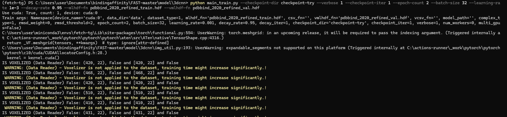

# 3D-CNN

Note that the original 3D-CNN implementation used in the paper below has been moved to 3dcnn_tf. This folder contains new version written using pytorch.

## Steps

### Step 1: Generate HDF
Follow steps mentioned in `data_util` to generate the input HDF that can be used by 3d-cnn and sg-cnn. 
In general, the steps are:
- ChimeraX: Add H
- Featurization: Using OpenBabel. Use `extract_pafnucy_data_with_docking.py`.
> Note: They were using tfbio dependency but I get dependency conflicts now. So, I pulled relevant code from tfbio into `tf_bio_featurizer.py` file.

### Step 2: Voxelise HDF
Run `voxelise_protein_hdf.py` file here in this folder to generate voxelised HDF to reduce the training time by avoiding voxelisation in each epoch for so many proteins.

> [NOTE][Fetch Devs] Voxelised files are huge like 30 GB so makes sure you have some space.

> [NOTE][Fetch Devs] Just get the train and val hdf for pdbind 2020 refined dataset from the drive to save your time :-) 

### Step 3: Train 3D CNN
Now train 3D CNN model using `main_train.py` script. 

#### Sample Run

> **NOTE 1:** Just run 2-5 epoch to see if things are working as expected

> **NOTE 2:** Sample training output files files help to debug.

> **NOTE 3:** Ignore voxelisation at your own risk!!!

python main_train.py --checkpoint-dir checkpoint-try --verbose 1 --checkpoint-iter 1 --epoch-count 2 --batch-size 32 --learning-rate 1e-3 --decay-rate 0.95

#### Hyperparam tuning
python main_train.py --checkpoint-dir checkpoint-lr-1e-3-dr-0.95 --checkpoint-iter 1 --epoch-count 100 --batch-size 32 --learning-rate 1e-3 --decay-rate 0.95

python main_train.py --checkpoint-dir checkpoint-lr-1e-3-dr-0.9 --checkpoint-iter 1 --epoch-count 100 --batch-size 32 --learning-rate 1e-3 --decay-rate 0.9

python main_train.py --checkpoint-dir checkpoint-lr-1e-3-dr-0.95 --checkpoint-iter 1 --epoch-count 100 --batch-size 32 --learning-rate 1e-3 --decay-rate 0.95

python main_train.py --checkpoint-dir clyde-train-2 --checkpoint-iter 1 --epoch-count 50 --batch-size 12 --learning-rate 1e-3 --decay-rate 0.97

python main_train.py --checkpoint-dir clyde-train-3 --checkpoint-iter 1 --epoch-count 50 --batch-size 64 --learning-rate 5e-3 --decay-rate 0.97

#### Manvi Decay rate experiments
python main_train.py --checkpoint-dir checkpoint-lr-4e-3-dr-0.95 --batch-size 16 --learning-rate 4e-3 --decay-rate 0.95
python main_train.py --checkpoint-dir checkpoint-lr-4e-3-dr-0.95 --batch-size 16 --learning-rate 4e-3 --decay-rate 0.9
python main_train.py --checkpoint-dir checkpoint-lr-4e-3-dr-0.95 --batch-size 16 --learning-rate 4e-3 --decay-rate 0.85
python main_train.py --checkpoint-dir checkpoint-lr-4e-3-dr-0.95 --batch-size 16 --learning-rate 4e-3 --decay-rate 0.8
python main_train.py --checkpoint-dir checkpoint-lr-4e-3-dr-0.95 --batch-size 16 --learning-rate 4e-3 --decay-rate 0.5

### Step 4: Evaluate 3D CNN model

#### Step 4.1: Test dataset evaluation
After training the model, run `main_eval.py` file to see the model performance on the test dataset.

#### Step 4.2: Intermediate layer outputs
If satisfied with the test performance, run this command again to 
save the intermendiate FC 10 layer for different complexes, the prediction values, etc 

#### Testing

python main_eval.py --mlhdf-fn "pdbbind2016_core_test.hdf" --model-path "checkpoint_3dcnn_refined_2020_lr_1e-3/best_checkpoint.pth" --batch-size 32
python main_eval.py --mlhdf-fn "pdbbind_2020_refined_val.hdf" --model-path "checkpoint_3dcnn_refined_2020_lr_1e-3/best_checkpoint.pth" --batch-size 32
python main_eval.py --mlhdf-fn "pdbbind_2020_refined_train.hdf" --model-path "checkpoint_3dcnn_refined_2020_lr_1e-3/best_checkpoint.pth" --batch-size 32

#### Testing Eval Summaries
[TEST-lR=7E-4 WITH voxalization] Evaluation Summary:
RMSE: 1.660, MAE: 1.317, R^2 score: 0.415, Pearson: 0.673, Spearman: 0.669, mean/std: 6.643/1.070

[TEST-lR=1E-3 stops at 50 epochs WITH voxalization]Evaluation Summary:
RMSE: 1.658, MAE: 1.319, R^2 score: 0.417, Pearson: 0.680, Spearman: 0.654, mean/std: 6.592/1.023

[TEST-lr=1E-3 batch size 12 decay rate 0.97 stops at 15 epochs WITHOUT voxalization] Evaluation Summary:
RMSE: 1.729, MAE: 1.352, R^2 score: 0.365, Pearson: 0.649, Spearman: 0.639, mean/std: 6.090/1.084

[TEST-lr=5E-3 batch size 64 decay rate 0.97 stops at 50 epochs WITH voxalization] Evaluation Summary:
RMSE: 1.716, MAE: 1.362, R^2 score: 0.375, Pearson: 0.658, Spearman: 0.643, mean/std: 6.271/0.950